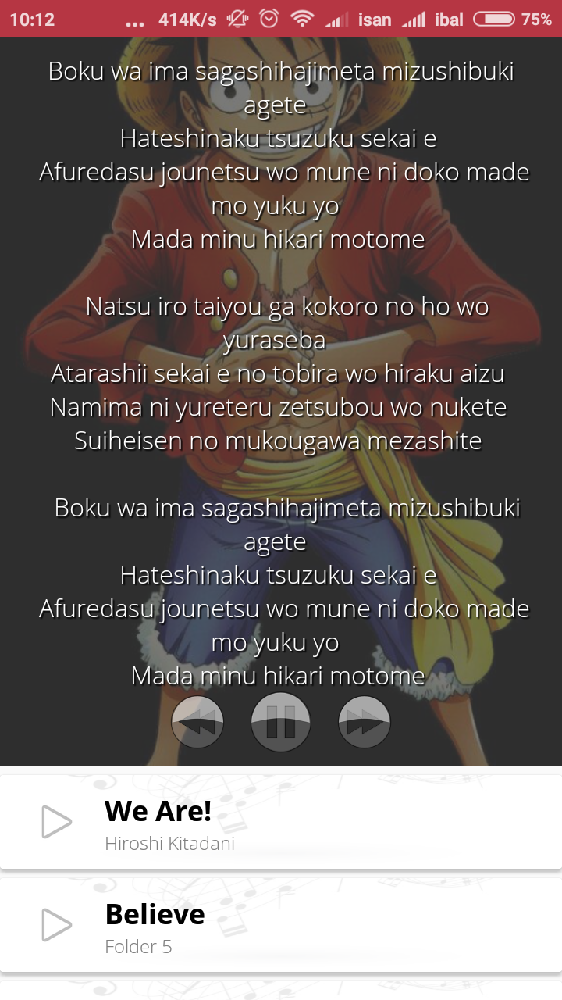
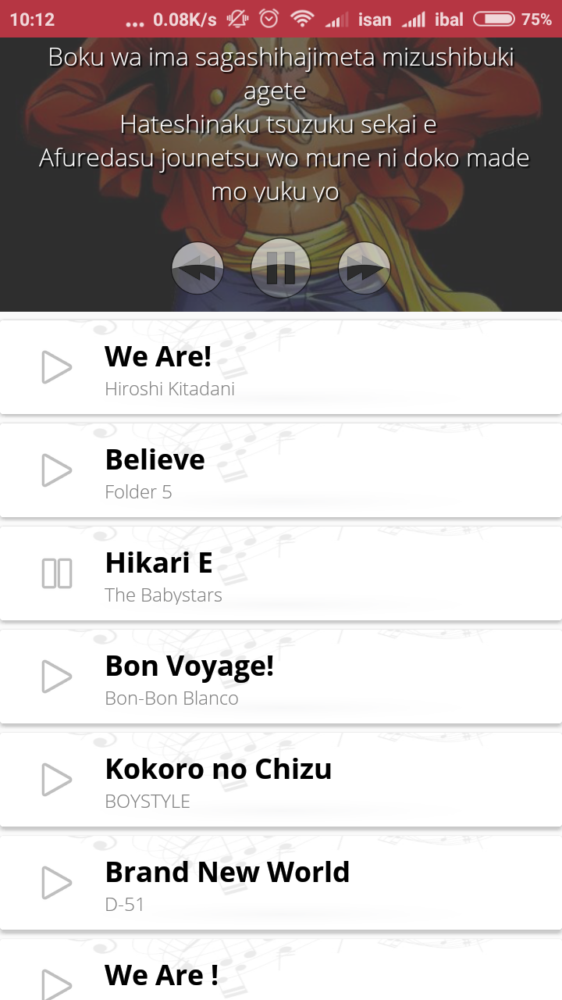
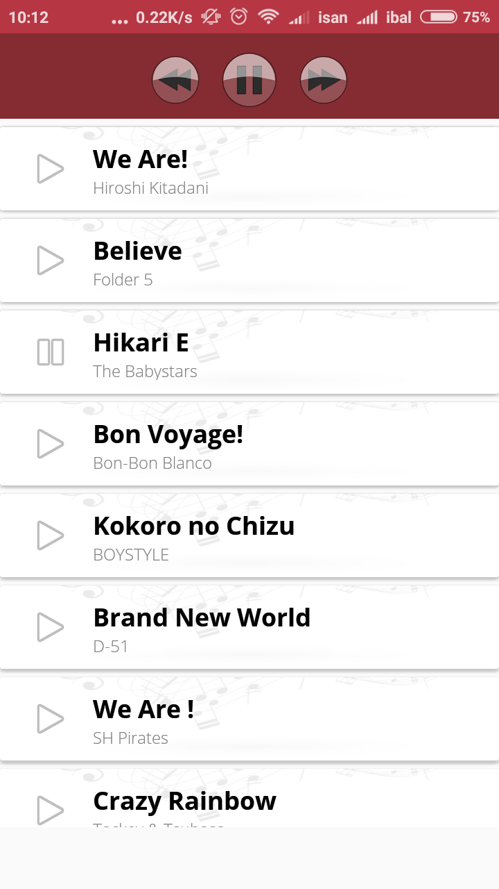

# Android Music Streaming with Lyrics

This is an open source project for streaming music with Lyrics
> aplikasi streaming musik android dengan lirik

</img>
</img>
</img>

To run this application you need an internet connection and web services to get song and lyrics list.
 
we also share json format for web services response `sample-api-response.json`

#### Libs
* [Retrofit](https://www.baeldung.com/retrofit)
* [converter-gson](https://github.com/square/retrofit/tree/master/retrofit-converters/gson)
* [glide](https://github.com/bumptech/glide)
* [recyclerview](https://github.com/googlesamples/android-RecyclerView)
* [cardview](https://github.com/googlesamples/android-CardView)
